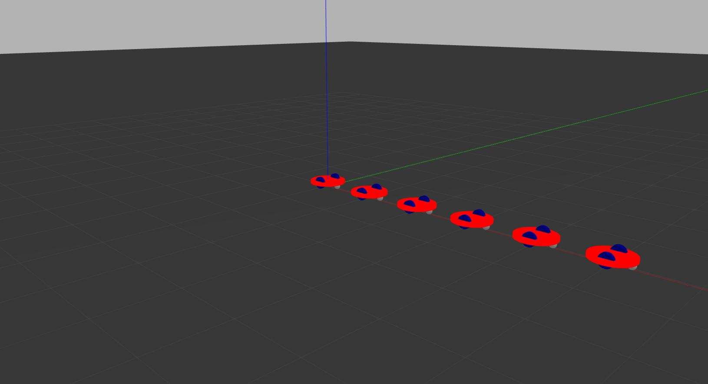

# ddMultiagentCoordinationSym
Multiagent Control System Simulator for Differential Drives robots

Implementation in ROS2 of the results and symulations of the IEEE article [J. Hu, P. Bhowmick and A. Lanzon, "Group Coordinated Control of Networked Mobile Robots With Applications to Object Transportation," in IEEE Transactions on Vehicular Technology, vol. 70, no. 8, pp. 8269-8274, Aug. 2021, doi: 10.1109/TVT.2021.3093157.](https://ieeexplore.ieee.org/abstract/document/9468402)

# First Steps
## Robot Spawning
First of all i have designed a differential drive robot similar to the one in the article, then i've written a launch file that spawns 6 identical robots with progressive namespaces.

You can launch the launchfile with the command:
`ros2 launch multi_robots launch_sim.launch.py`

Then if i list all the nodes i get:

> /gazebo  
> /robot1/diff_drive  
> /robot1/robot_state_publisher  
> /robot2/diff_drive  
> /robot2/robot_state_publisher  
> /robot3/diff_drive  
> /robot3/robot_state_publisher  
> /robot4/diff_drive  
> /robot4/robot_state_publisher  
> /robot5/diff_drive  
> /robot5/robot_state_publisher  
> /robot6/diff_drive  
> /robot6/robot_state_publisher  

And if i list the topics:
> /clock  
> /parameter_events  
> /performance_metrics  
> /robot1/cmd_vel  
> /robot1/joint_states  
> /robot1/odom  
> /robot1/robot_description  
> /robot1/tf  
> /robot1/tf_static  
> /robot2/cmd_vel  
> /robot2/joint_states  
> /robot2/odom  
> /robot2/robot_description  
> /robot2/tf  
> /robot2/tf_static  
> /robot3/cmd_vel  
> /robot3/joint_states  
> /robot3/odom  
> /robot3/robot_description  
> /robot3/tf  
> /robot3/tf_static  
> /robot4/cmd_vel  
> /robot4/joint_states  
> /robot4/odom  
> /robot4/robot_description  
> /robot4/tf  
> /robot4/tf_static  
> /robot5/cmd_vel  
> /robot5/joint_states  
> /robot5/odom  
> /robot5/robot_description  
> /robot5/tf  
> /robot5/tf_static  
> /robot6/cmd_vel  
> /robot6/joint_states  
> /robot6/odom  
> /robot6/robot_description  
> /robot6/tf  
> /robot6/tf_static  
> /rosout  
> /tf

If you want to play around driving the robots you can do it using `ros2 run teleop_twist_keyboard teleop_twist_keyboard --ros-args --remap cmd_vel:=/robot1/cmd_vel` and substituting to `robot1` the namespace of the robot that you want to move.

If you want to spawn a different number of robots, or spawn them at different distance you just have to edit the [launch_config.yaml](./config/launch_config.yaml) file.

## Functions
The second step has been to write the functions needed to calculate matrices, arrays and all the other values that you can need in the program.

You can find thoose under [src/utilities.h](./src/utilities.h)

Here you can find the status of the function written associated to the formulas:

 - :white_check_mark: = Implemented and tested
 - :warning: = Implemented but not tested
 - :no_entry: = Not Implemented

| Number | Description | Name | Status |
| -------- | ------- | ------- | ------ |
| 1 | Weights of Graph | getWeighMatrix | :warning: |
